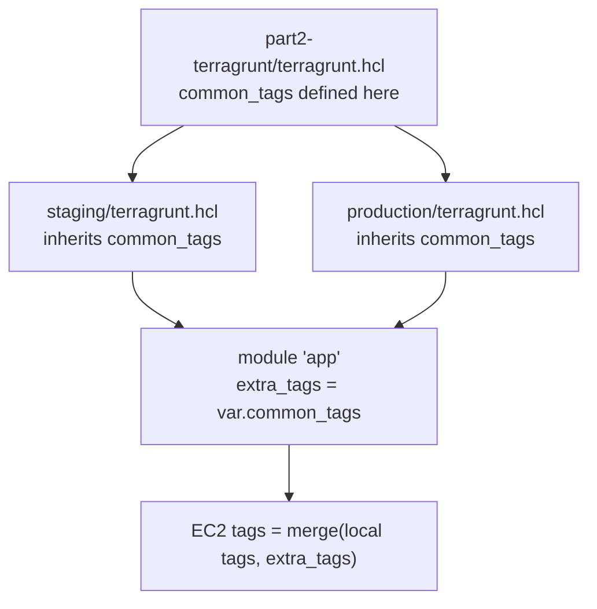

# Terraform Modules Demo


A demo repository for the teaching presentation: **"Introducing Terraform Modules: Making Infrastructure As Code Easier"**

This repo teaches Terraform Modules and Terragrunt DRY patterns with real-world EC2 examples, written with detailed comments for easy understanding.

---

## Table of Contents

- [Overview](#overview)
- [Project Structure](#project-structure)
- [Part 1: Local Modules](#part-1-local-modules)
- [Part 2: Terragrunt (Bonus)](#part-2-terragrunt-bonus)
- [Getting Started](#getting-started)
- [Experiments](#experiments)
- [Important Notes](#important-notes)
- [References](#references)

---

## Overview

**Learning objectives:**
- Understand how to create and use Terraform modules
- See how a single module can be reused across multiple environments
- Learn Terragrunt as a tool to reduce code duplication
- Practice with real-world examples (EC2 instances)

---

## Project Structure

```
terraform-modules-demo/
├── modules/
│   ├── ec2/                  # Reusable EC2 instance module
│   └── security-group/       # Reusable Security Group module
├── part1-modules/            # Part 1: Local Modules demo
│   ├── staging/
│   └── production/
└── part2-terragrunt/         # Bonus Part 2: Terragrunt DRY pattern
    ├── terragrunt.hcl        # Root config (common_tags defined here)
    ├── staging/
    └── production/
```

**Part 1** focuses on Terraform module fundamentals with 2 reusable modules.  
**Part 2** shows how Terragrunt makes code more DRY (Don't Repeat Yourself).

---

## Part 1: Local Modules

### How to Read the Flow

1. **Start at `modules/ec2/`** — blueprint for EC2 instances
   - `variables.tf` → input definitions
   - `main.tf` → actual EC2 resource
   - `outputs.tf` → data returned to the caller

2. **Then `modules/security-group/`** — blueprint for Security Groups
   - `variables.tf` → input definitions (name, environment, ingress_rules)
   - `main.tf` → security group resource with dynamic ingress rules
   - `outputs.tf` → returns `security_group_id`

3. **See `part1-modules/staging/`** — first environment
   - Calls 2 modules: security-group + ec2
   - Config: 3 instances, t3.micro

4. **Compare with `part1-modules/production/`** — second environment
   - Calls the **same modules** with different values
   - Config: 5 instances, t3.large

### The Aha Moment

**Two environments, two reusable modules — one codebase!**

| Environment | instance_count | instance_type | security_group |
|-------------|----------------|---------------|----------------|
| Staging     | 3              | t3.micro      | staging-sg     |
| Production  | 5              | t3.large      | production-sg  |

This is the power of modules: **Write once, use everywhere!**

---

## Part 2: Terragrunt (Bonus)

### Problem It Solves

Part 1 already reduces duplication with modules, but there's still repetition:

❌ **Without Terragrunt:**
- Provider config repeated in every environment
- Tags like `Project`, `ManagedBy`, `Version` must be written manually everywhere
- Updating a version means editing multiple files

✅ **With Terragrunt:**
- Provider config auto-generated
- Common tags defined once at root, automatically injected into all environments
- Update version in 1 line → all resources updated!

### How `common_tags` Works



1. **Define in root `part2-terragrunt/terragrunt.hcl`:**
   ```hcl
   inputs = {
     common_tags = {
       Project   = "terraform-modules-demo"
       ManagedBy = "Terragrunt"
       Version   = "v1.0.0"
     }
   }
   ```

2. **Automatically available in child configs** — no need to repeat in staging or production.

3. **Used in Terraform code:**
   ```hcl
   module "app" {
     extra_tags = var.common_tags
   }
   ```

4. **Merged in the EC2 module:**
   ```hcl
   tags = merge(
     { Name = "...", Environment = "..." },
     var.extra_tags
   )
   ```

### Highlight: Update Version in 1 Line

Change `Version = "v1.0.0"` to `Version = "v2.0.0"` in `part2-terragrunt/terragrunt.hcl` — all resources in staging **and** production will automatically get `Version = "v2.0.0"` without touching any other file.

---

## Getting Started

### Prerequisites

- [Terraform](https://developer.hashicorp.com/terraform/install) >= 1.0
- [Terragrunt](https://terragrunt.gruntwork.io/docs/getting-started/install/) (for Part 2)
- AWS credentials configured (only needed for `terraform apply`)

### Part 1: Local Modules

```bash
# Staging
cd part1-modules/staging
terraform init
terraform plan

# Production
cd ../production
terraform init
terraform plan
```

### Part 2: Terragrunt

```bash
# Staging
cd part2-terragrunt/staging
terragrunt init
terragrunt plan

# Production
cd ../production
terragrunt init
terragrunt plan
```

> **Note:** Terragrunt will auto-generate a `provider.tf` file in each environment folder.

> **Do not run `terraform apply` / `terragrunt apply`** unless you have AWS credentials and are ready to create real resources!

---

## Experiments

### Experiment 1: Change Instance Count
```bash
cd part1-modules/staging
# Edit main.tf: change instance_count from 3 to 2
terraform plan
# See how Terraform plans to destroy 1 instance
```

### Experiment 2: Customize Security Group Rules
```hcl
# Edit part1-modules/staging/main.tf
module "security_group" {
  source      = "../../modules/security-group"
  name        = "sg"
  environment = "staging"

  ingress_rules = [
    {
      from_port   = 22
      to_port     = 22
      protocol    = "tcp"
      cidr_blocks = ["10.0.0.0/8"]   # Internal network only
    },
    {
      from_port   = 443
      to_port     = 443
      protocol    = "tcp"
      cidr_blocks = ["0.0.0.0/0"]    # HTTPS from anywhere
    }
  ]
}
```

### Experiment 3: Add a New Tag in Terragrunt
```hcl
# Edit part2-terragrunt/terragrunt.hcl
inputs = {
  common_tags = {
    Project   = "terraform-modules-demo"
    ManagedBy = "Terragrunt"
    Version   = "v1.0.0"
    Owner     = "DevOps Team"   # New tag!
  }
}
```
Run `terragrunt plan` in staging and production — the new tag appears in all resources automatically!

### Experiment 4: Add a New Environment (UAT)
```bash
cp -r part2-terragrunt/staging part2-terragrunt/uat

# Edit part2-terragrunt/uat/terragrunt.hcl
inputs = {
  environment    = "uat"
  instance_count = 2
  instance_type  = "t3.small"
}

cd part2-terragrunt/uat
terragrunt init
terragrunt plan
```

---

## Important Notes

**This repo is for DEMO and LEARNING purposes only!**

- ❌ Do not apply to real AWS without understanding the consequences
- ❌ No remote backend configured (state stored locally)
- ❌ Security group rules use `0.0.0.0/0` by default (not safe for production)
- ❌ No complete error handling or input validation

For production use:
- Set up a remote backend (S3 + DynamoDB)
- Restrict security group rules via the `ingress_rules` variable
- Add proper validation and error handling
- Use AWS credentials with a least-privilege IAM role

---

## Author

**Ni Putu Sintia Wati**
- GitHub: [@sintiasnn](https://github.com/sintiasnn)

---

## References

- [Terraform Modules Documentation](https://developer.hashicorp.com/terraform/language/modules)
- [Terragrunt Documentation](https://terragrunt.gruntwork.io/docs/)
- [AWS Provider Documentation](https://registry.terraform.io/providers/hashicorp/aws/latest/docs)

---

**Happy learning! 🚀**

If you have questions or find a bug, feel free to open an issue or discuss with the instructor.
